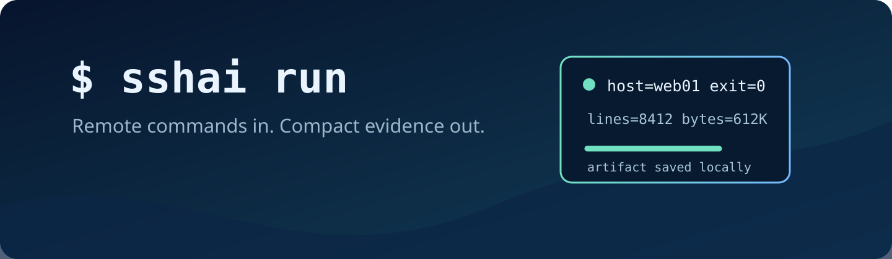

Русская версия: [README.ru.md](README.ru.md).

# sshai

<p align="center"></p>

[](https://github.com/aprudkin/sshai/actions/workflows/ci.yml)
[](go.mod)
[](LICENSE)
[](skills/sshai/SKILL.md)
[](https://www.openssh.com/)

`sshai` is a Go CLI for AI agents that runs non-interactive Linux commands through Bash by default
or an explicitly selected POSIX shell, and Windows PowerShell commands over SSH. PowerShell 7
(`pwsh`) is the default; Windows PowerShell 5.1 is selectable per invocation. It keeps captured
command output in a local artifact and returns a compact passport instead of flooding agent context.

Remote commands in. Compact evidence out.

## Who it is for

Use `sshai` for already-authorized, non-interactive commands on hosts reachable through
`ssh_config`, when you need evidence without replaying large results into an agent conversation.
It keeps transport, evidence, and operational authority separate.

## Agent skill

For agent-driven use, install the bundled [`sshai` skill](skills/sshai/SKILL.md) together with the
CLI. The CLI works on its own, but the skill teaches an agent when to use `sshai`, how to keep large
output out of context, how to query saved artifacts, and where the safety boundaries are.

The skill follows the Agent Skills specification and is not tied to Pi. Pi and other compatible
agent harnesses can load the same skill.

## Capabilities

- Run commands on one or more Linux SSH aliases through Bash by default or a selected POSIX shell.
- Run commands on one or more Windows/PowerShell SSH aliases with PowerShell 7 as the default and
  Windows PowerShell 5.1 selectable per invocation.
- Store output locally and return a bounded passport with outcome and artifact location.
- Query, diff, and search artifacts without replaying whole command results.
- Use `--body-file` for multiline commands, JSON result envelopes, `--delta`, and named contexts.
- Return bounded, sanitized diagnostics for recognized SSH failures.
- Fail closed for interactive programs, secret stdin, ad-hoc identities, and unsupported two-hop
  execution.

The execution path keeps captured output local and returns only bounded evidence to agent context:

<picture>
  <source media="(prefers-color-scheme: dark)" srcset="assets/readme/architecture-dark.svg">
  <source media="(prefers-color-scheme: light)" srcset="assets/readme/architecture-light.svg">
  
</picture>

## Install

`sshai` requires OpenSSH and a configured SSH alias. Building from source also requires Go `1.26.5`
or newer in the `1.26` line.

### Homebrew

The Homebrew package is prepared for v1.0.0 but is not published yet. After the release and tap are
published, install the CLI and its bundled skill with:

```bash
brew install aprudkin/tap/sshai
```

Pi users can then enable the installed skill explicitly:

```bash
pi install "$(brew --prefix sshai)/share/sshai"
```

Other Agent Skills-compatible harnesses can load `skills/sshai/SKILL.md` from the package share
directory reported by `brew --prefix sshai`.

### From source

```bash
git clone https://github.com/aprudkin/sshai.git
cd sshai
go test ./...
scripts/install.sh
```

The installer copies the skill to `${SSHAI_SHARE_DIR:-$HOME/.local/share/sshai}`. Pi can load that
directory as a local package:

```bash
pi install "${SSHAI_SHARE_DIR:-$HOME/.local/share/sshai}"
```

Other compatible harnesses can load or copy its `skills/sshai/` directory into their configured
skill location.

## Quick start

```bash
sshai run web01 -- df -h
```

Keep a multiline body out of process arguments:

```bash
sshai run --body-file check.ps1 win01
```

Linux uses Bash by default. On a Linux host such as OpenWrt that lacks Bash, select its POSIX shell
explicitly:

```bash
sshai run --posix-shell /bin/ash openwrt01 -- uname -s
```

`--posix-shell` accepts one path/token without whitespace or control characters. It affects Linux
hosts only; Windows hosts in a mixed fan-out retain their PowerShell selection. A missing selected
shell is a remote error—`sshai` never falls back to Bash.

PowerShell 7 remains the Windows default. Select Windows PowerShell 5.1 when a command requires it:

```bash
sshai run --powershell-host windows-powershell --body-file check.ps1 sccm01
```

After direct authorization for one exact alias, accept only its previously unknown host key:

```bash
sshai run --accept-new-host-key new01 new01 -- uname -a
```

Bypass a configured `ProxyJump` for one direct-route invocation without changing `ssh_config`:

```bash
sshai run --proxy-jump=none direct01 -- uname -a
```

For automation, request a versioned JSON envelope:

```bash
sshai run --result-format=json web01 -- uname -a
```

For one long-running host command, opt into bounded JSONL events on stderr while preserving the
normal final stdout result:

```bash
sshai run --follow --follow-interval 5 web01 -- long-running-check
```

Recognized SSH failures expose only a canonical `transport_diagnostic`; raw SSH stderr remains
private. An explicitly authorized host-key acceptance also returns the accepted algorithm and
SHA-256 fingerprint.

Run `sshai help` for the command inventory and `sshai help run` for its full execution contract.

## Safety boundary

`sshai` is a transport and evidence tool. It does not grant permission to access or change a
host.

- Use it only for separately authorized actions on configured aliases.
- Keep passwords, tokens, keys, certificates, and expected secret output out of command text and
  artifacts.
- Use `--accept-new-host-key HOST` only after direct authorization for that exact alias, and
  `--proxy-jump=none` only for an explicitly selected direct-route invocation.
- Use a separate approved workflow for secret stdin, file transfer, interactive programs,
  ad-hoc identity options, or unsupported two-hop execution.
- A policy denial, transport failure, and remote non-zero exit are different outcomes.
- The archived `ps_ssh.py` helper is not a fallback.

See [agent usage](docs/agent-usage.md) for default-use and fallback rules.

## Development and contributing

```bash
go test ./...
go vet ./...
go build ./...
```

Integration tests require reachable test hosts and are intentionally outside CI:

```bash
go test -tags=integration ./...
```

Read [CONTRIBUTING.md](CONTRIBUTING.md), [SECURITY.md](SECURITY.md), and the
[Code of Conduct](CODE_OF_CONDUCT.md) before opening an issue or pull request.

## Measured results

The figures below come from two completed measurements: a controlled comparison and a separate
production collection. Estimated token counts use `ceil(UTF-8 bytes / 4)`.

### Controlled v1.1 benchmark

The controlled benchmark ran on 2026-08-13 with 36 read-only observations across two Linux hosts
and one Windows host running PowerShell 7.6.3. The raw-SSH and `sshai` branches each used a fresh
Codex session.

| Measurement | Raw SSH | `sshai` | Difference |
| --- | ---: | ---: | ---: |
| Total agent-visible marked output, estimated tokens | 855,806 | 1,227 | **99.86% lower** |
| Agent-visible marked output p95, estimated tokens | 262,152 | 50 | **99.98% lower** |
| Actual Codex input tokens | 2,896,077 | 1,601,293 | **44.71% lower** |
| Successful observations | 34 / 36 | 34 / 36 | equal (94.44%) |

Four of the five predefined targets passed. The primary target of at least 80% lower actual input
tokens did not; the recorded decision is **needs work**. The two runs had the same success rate but
failed on different observations, so this measurement does not compare transport reliability.
The method, data boundaries, and failure details are documented in the
[v1.1 benchmark report](docs/benchmarks/v1.1-results-2026-08-13.md).

### Production collection

An anonymized production run on 2026-08-25 used `sshai` for an approved PCI DSS collection across
79 Windows servers. It produced 158 raw report files. Archives were retrieved separately, and the
SHA-256 of every retrieved archive matched the value reported by its source.

| Measurement | Bytes | Estimated tokens |
| --- | ---: | ---: |
| Full set of 158 reports | 8,123,158 | ~2.03M |
| Agent-visible orchestration, status, and receipt stream | 49,846 | ~12.5K |

The agent-visible stream was 0.61% of the report data: about **163× smaller**, or **99.39% fewer
bytes**. This was an operational measurement, not a controlled comparison with raw SSH.

## License

MIT. See [LICENSE](LICENSE).
