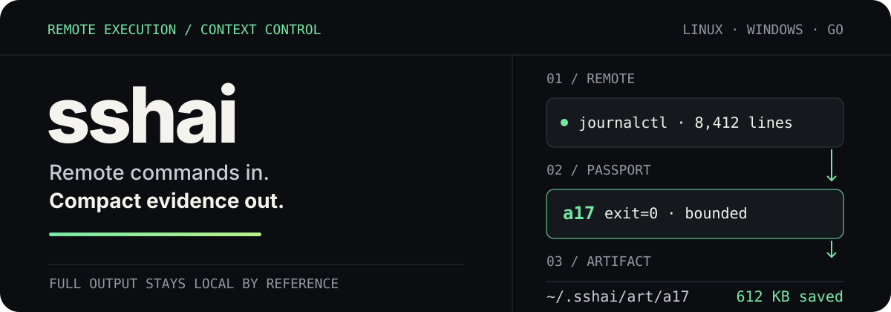

# sshai

<p align="center">
  
</p>

`sshai` is a Go CLI for AI agents that runs non-interactive commands on Linux bash and Windows
PowerShell 7 hosts over SSH. It returns a budget-bounded result to the conversation and keeps the
captured output on disk for local querying.

> Remote commands in. Compact evidence out. Full output stays available by reference.

## See the result, not the noise

A large remote result becomes a compact *passport*:

```console
$ sshai run pg-prod-01 -- journalctl -u postgres --since -1h
a17 host=pg-prod-01 exit=0 lines=8412 bytes=612K time=1.8s
file=~/.sshai/art/a17
tail3:
  ...
```

The agent can inspect only what it needs, without replaying the complete artifact into context:

```console
$ sshai q a17 -- grep -iE 'fatal|error'
$ sshai diff a12 a17
$ sshai log --host pg-prod-01 --since 2h
```

Artifacts are plain local files. Run metadata remains searchable after context compaction, and
`--delta` can return only what changed between repeated checks.

## Quick start

Build and atomically install the current checkout into `~/.local/bin`:

```bash
scripts/install.sh
```

Then run a command against an alias already defined in `ssh_config`:

```bash
sshai run web01 -- df -h
```

Use `--body-file` for multi-line or quote-heavy commands so the body stays out of process
arguments:

```bash
sshai run --body-file check.ps1 win01
```

Run `sshai help` for the command inventory or `sshai help run` for the complete execution
contract.

## How it protects agent context

```text
command → SSH transport → captured artifact → bounded passport → local q / diff / log
```

1. `sshai run` owns command staging, transport, shell selection, encoding, and collection.
2. Small results may be returned inline; large results return metadata and the last three lines.
3. Full captured output remains under `~/.sshai/art/<id>` up to the configured stream cap.
4. `q`, `diff`, `log`, and `--delta` bring back only the evidence needed for the next decision.
5. Fan-out shares the output budget across hosts instead of multiplying it per host.

The factory inline threshold is a 500-token estimate, calculated as `ceil(bytes / 4)`. It is a
predictable byte budget, not a model-specific tokenizer.

## Machine-readable results

For orchestration, add `--result-format=json`. Stdout becomes exactly one versioned envelope with
`schema_version: "v1"`; diagnostics remain on stderr.

```bash
sshai run --result-format=json web01 -- uname -a | jq '.runs[0] | {host, exit, artifact_path}'
```

`--result-out <file>` atomically publishes the same envelope to one regular file with mode `0600`.
Symlinks, directories, and other non-regular destinations are refused. File and stdin bodies are
represented by a hash in stored metadata rather than by their command text.

## Safety boundary

`sshai` is a transport and evidence tool. It does not authorize remote changes or replace an
operational runbook.

- Use it for non-interactive Linux bash or Windows PowerShell 7 commands on configured SSH aliases.
- Keep passwords, tokens, keys, and other secrets out of command text and expected output.
- Use a separate approved workflow for secret stdin, file transfer, interactive programs,
  PowerShell 5.1, ad-hoc identity options, or unsupported two-hop execution.
- A readonly policy denial, transport failure, and remote non-zero exit remain distinct outcomes.
- The archived `ps_ssh.py` helper is not a fallback.

See [agent usage](docs/agent-usage.md) for the default-use rule and explicit fallback contract.

## Measured context economics

The controlled v1.1 benchmark completed on 2026-08-13 with 36 read-only observations across two
Linux hosts and one Windows host, using fresh raw-SSH and `sshai` Codex sessions.

| Measurement | Raw SSH | `sshai` | Result |
| --- | ---: | ---: | ---: |
| Agent-visible marked tool output, p95 estimated tokens | 262,152 | 50 | **99.86% lower** |
| Actual Codex input tokens | 2,896,077 | 1,601,293 | **44.71% lower** |
| Successful observations | 34 / 36 | 34 / 36 | equal |

The p95, compaction, success, and quoting-debug targets passed. The primary target of at least 80%
lower actual input tokens did not, so the recorded decision is **needs work**, not “v1.1
confirmed.” Read the [full result and its boundaries](docs/benchmarks/v1.1-results-2026-08-13.md).

The next follow-up fan-out experiment is defined by the latest
[v2.1 protocol](docs/benchmarks/v2.1-protocol.md) and
[analyzer definition](docs/benchmarks/v2.1-analyzer.md). It requires paired no-op controls, fixed
populations, one fenced command per agent-visible command item, executable provenance, lifecycle
cross-checks, and eight balanced complete replicates with at least six defined control-adjusted
reductions before a result can be promoted. The amendment-2 root has not been measured yet.

## Command surface

```text
sshai run [flags] <host...> -- <command>      execute; multiple hosts fan out
sshai run --body-file <file|-> <host...>      read a body from a file or stdin
sshai q <id> -- <tool> <args...>              query one stored artifact locally
sshai diff <id1> <id2>                        compare two stored artifacts
sshai log [--host H] [--since T] [--grep P]  search run history
sshai hosts                                   list known aliases and cached facts
sshai gc                                      prune artifacts by retention policy
sshai help [command]                          show concise or detailed help
```

## Project status

Version 1 implements single-host and fan-out execution, bounded passports, artifacts, local
queries, diffs, deltas, searchable history, named state contexts, readonly policy, and JSON result
envelopes. Linux and Windows paths have live acceptance evidence recorded in the repository.

- [Architecture and CLI design](docs/superpowers/specs/2026-08-06-sshai-design.md)
- [Purpose and definition of done](docs/superpowers/specs/2026-08-06-sshai-charter.md)
- [Windows parity evidence](docs/windows-parity.md)
- [Server-workflow migration and live acceptance](docs/server-workflow-migration.md)
- [Agent-facing usage reference](docs/agent-usage.md)

Implementation: Go 1.26.5, one executable, no daemon. Unit-test CI and a license choice remain
pending before the private repository is made public.
