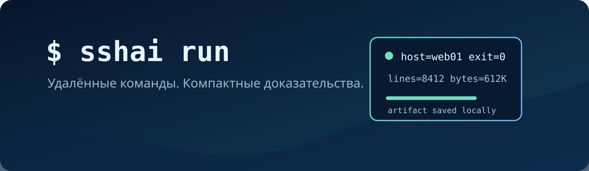

English version: [README.md](README.md).

# sshai

<p align="center"></p>

[](https://github.com/aprudkin/sshai/actions/workflows/ci.yml)
[](go.mod)
[](LICENSE)
[](skills/sshai/SKILL.md)
[](https://www.openssh.com/)

`sshai` — утилита командной строки на `Go` для ИИ-агентов, запускающая неинтерактивные команды
`Linux` через `Bash` по умолчанию или через явно выбранную `POSIX`-оболочку, а команды
`Windows PowerShell` — по SSH. По умолчанию используется `PowerShell 7` (`pwsh`); для отдельного
запуска можно выбрать `Windows PowerShell 5.1`. Полученный вывод сохраняется локально, а в контекст
агента возвращается компактный паспорт запуска.

Удалённые команды внутрь. Компактные доказательства наружу.

## Для кого

Используйте `sshai` для уже авторизованных неинтерактивных команд на хостах из `ssh_config`, когда
нужны доказательства без загрузки большого вывода в диалог агента. Инструмент разделяет транспорт,
доказательства и операционные полномочия.

## Навык для ИИ-агента

При работе через ИИ-агента устанавливайте [навык `sshai`](skills/sshai/SKILL.md) вместе с утилитой.
Утилита работает и сама по себе, но навык объясняет агенту, когда использовать `sshai`, как не
загружать большой вывод в контекст, как запрашивать сохранённые артефакты и где проходят границы
безопасности.

Навык соответствует спецификации Agent Skills и не привязан к Pi. Его можно подключить в Pi и
других совместимых агентских средах.

## Возможности

- Запуск на одном или нескольких SSH-алиасах `Linux` через `Bash` по умолчанию или через выбранную
  `POSIX`-оболочку.
- Запуск на алиасах `Windows`/`PowerShell` с `PowerShell 7` по умолчанию и выбором
  `Windows PowerShell 5.1` для отдельного запуска.
- Локальное хранение вывода и компактный паспорт с исходом и путём к артефакту.
- Запросы, сравнения и поиск по артефактам без повторной загрузки всего результата.
- `--body-file` для многострочных команд, JSON-конверты результатов, `--delta` и именованные
  контексты.
- Ограниченная очищенная диагностика распознанных сбоев SSH.
- Явный отказ вместо небезопасного обхода ограничений для интерактивных программ, секретов в stdin,
  разовых параметров идентификации и неподдерживаемых двухпереходных сценариев.

В ходе выполнения полученный вывод остаётся локальным, а в контекст агента возвращаются только
ограниченные доказательства:

<picture>
  <source media="(prefers-color-scheme: dark)" srcset="assets/readme/architecture-dark.svg">
  <source media="(prefers-color-scheme: light)" srcset="assets/readme/architecture-light.svg">
  
</picture>

## Установка

Для работы `sshai` нужны OpenSSH и настроенный SSH-алиас. Для сборки из исходного кода также
требуется Go `1.26.5` или новее в ветке `1.26`.

### Через Homebrew

Пакет Homebrew подготовлен для версии v1.0.0, но пока не опубликован. После публикации релиза и
репозитория Homebrew tap установите утилиту вместе с вложенным навыком:

```bash
brew install aprudkin/tap/sshai
```

В Pi установленный навык подключается отдельной явной командой:

```bash
pi install "$(brew --prefix sshai)/share/sshai"
```

Другие среды с поддержкой Agent Skills могут загрузить `skills/sshai/SKILL.md` из каталога пакета,
путь к которому выводит `brew --prefix sshai`.

### Из исходного кода

```bash
git clone https://github.com/aprudkin/sshai.git
cd sshai
go test ./...
scripts/install.sh
```

Установщик копирует навык в `${SSHAI_SHARE_DIR:-$HOME/.local/share/sshai}`. Pi может загрузить этот
каталог как локальный пакет:

```bash
pi install "${SSHAI_SHARE_DIR:-$HOME/.local/share/sshai}"
```

В других совместимых средах загрузите или скопируйте вложенный каталог `skills/sshai/` в
настроенный каталог навыков.

## Быстрый старт

```bash
sshai run web01 -- df -h
```

Не передавайте многострочное тело через аргументы процесса:

```bash
sshai run --body-file check.ps1 win01
```

По умолчанию `Linux` использует `Bash`. На хосте `Linux`, например `OpenWrt`, где `Bash`
отсутствует, явно задайте `POSIX`-оболочку:

```bash
sshai run --posix-shell /bin/ash openwrt01 -- uname -s
```

`--posix-shell` принимает один путь или токен без пробельных и управляющих символов. Этот параметр
действует только на хосты `Linux`; хосты `Windows` в смешанном запуске по нескольким хостам
сохраняют выбор `PowerShell`. Если выбранная оболочка отсутствует, удалённая команда возвращает
ошибку; `sshai` не переключается на `Bash`.

На Windows по умолчанию используется PowerShell 7. Если команде нужен Windows PowerShell 5.1,
выберите его явно:

```bash
sshai run --powershell-host windows-powershell --body-file check.ps1 sccm01
```

После прямого разрешения для одного точного алиаса примите только его ранее неизвестный ключ:

```bash
sshai run --accept-new-host-key new01 new01 -- uname -a
```

Для одного запуска по прямому маршруту обойдите настроенный `ProxyJump`, не меняя `ssh_config`:

```bash
sshai run --proxy-jump=none direct01 -- uname -a
```

Для автоматизации используйте версионированный JSON-конверт:

```bash
sshai run --result-format=json web01 -- uname -a
```

Для распознанных сбоев SSH возвращается только каноническое поле `transport_diagnostic`; сырой
stderr SSH не раскрывается. Явно разрешённое принятие ключа также возвращает его алгоритм и
SHA-256-отпечаток.

Полный список команд — `sshai help`, контракт запуска — `sshai help run`.

## Граница безопасности

`sshai` — инструмент транспорта и доказательств. Он не выдаёт полномочий на доступ к хосту или
изменение его состояния.

- Выполняйте только отдельно авторизованные действия на настроенных алиасах.
- Не передавайте в командах или артефактах пароли, токены, ключи, сертификаты и ожидаемый секретный
  вывод.
- Используйте `--accept-new-host-key HOST` только после прямого разрешения для этого точного алиаса,
  а `--proxy-jump=none` — только для явно выбранного запуска по прямому маршруту.
- Для секретов в stdin, передачи файлов, интерактивных программ, разовых параметров идентификации и
  неподдерживаемых двухпереходных сценариев нужен отдельный утверждённый процесс.
- Отказ политики, транспортный сбой и ненулевой код завершения удалённой команды — разные исходы.
- Архивный помощник `ps_ssh.py` не является запасным вариантом.

См. [руководство для агентов](docs/agent-usage.md) с правилами использования по умолчанию и
резервными путями.

## Разработка и вклад

```bash
go test ./...
go vet ./...
go build ./...
```

Интеграционные тесты требуют доступных тестовых хостов и намеренно не входят в CI:

```bash
go test -tags=integration ./...
```

Перед созданием issue или pull request прочтите [CONTRIBUTING.md](CONTRIBUTING.md),
[SECURITY.md](SECURITY.md) и [Code of Conduct](CODE_OF_CONDUCT.md).

## Результаты измерений

Ниже приведены два завершённых измерения: контролируемое сравнение и отдельный рабочий сбор.
Оценочные значения токенов рассчитаны как `ceil(UTF-8 bytes / 4)`.

### Контролируемый бенчмарк v1.1

Контролируемый бенчмарк прошёл 13 августа 2026 года. Он включал 36 проверок только для чтения на
двух Linux-хостах и одном Windows-хосте с PowerShell 7.6.3. Для прямого SSH и `sshai` использовались
отдельные новые Codex-сессии.

| Метрика | Прямой SSH | `sshai` | Разница |
| --- | ---: | ---: | ---: |
| Весь видимый агенту помеченный вывод, оценка в токенах | 855,806 | 1,227 | **меньше на 99.86%** |
| p95 видимого агенту помеченного вывода, оценка в токенах | 262,152 | 50 | **меньше на 99.98%** |
| Фактические входные токены Codex | 2,896,077 | 1,601,293 | **меньше на 44.71%** |
| Успешные проверки | 34 / 36 | 34 / 36 | одинаково (94.44%) |

Из пяти заранее заданных критериев выполнены четыре. Основной критерий — сократить фактические
входные токены не менее чем на 80% — не выполнен; зафиксированный итог — **needs work**. Доля
успешных проверок совпала, но сбои произошли на разных проверках, поэтому это измерение не
сравнивает надёжность транспортов. Методика, границы данных и сведения о сбоях приведены в
[отчёте о бенчмарке v1.1](docs/benchmarks/v1.1-results-2026-08-13.md).

### Рабочий сбор

Обезличенный рабочий сбор 25 августа 2026 года охватил 79 Windows-серверов. В результате получено
158 исходных файлов отчётов. Архивы выгружались отдельно. SHA-256 каждого полученного архива
совпал со значением, сообщённым источником.

| Метрика | Байты | Оценка токенов |
| --- | ---: | ---: |
| Полный набор из 158 отчётов | 8,123,158 | ~2.03M |
| Видимый агенту поток управления, статусов и квитанций | 49,846 | ~12.5K |

Видимый агенту поток составил 0.61% от объёма отчётов: примерно в **163 раза меньше**, или на
**99.39% меньше байтов**. Это эксплуатационное измерение, а не контролируемое сравнение с прямым
SSH.

## Лицензия

MIT. См. [LICENSE](LICENSE).
