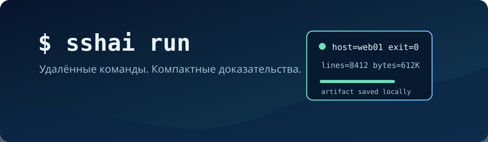

[English version](README.md).

# sshai

<p align="center"></p>

[](https://github.com/aprudkin/sshai/actions/workflows/ci.yml)
[](https://github.com/aprudkin/sshai/actions/workflows/security.yml)
[](https://github.com/aprudkin/sshai/releases/latest)
[](https://github.com/aprudkin/homebrew-tap)
[](go.mod)
[](LICENSE)
[](skills/sshai/SKILL.md)

`sshai` — утилита командной строки на Go для ИИ-агентов. Она выполняет неинтерактивные команды
на Linux- и Windows-хостах через SSH, а при явном выборе локального выполнения — на машине,
где запущена утилита.

Вывод команды сохраняется локально в **артефакте**. Вместо всего вывода агент получает
**паспорт запуска**: статус, путь к артефакту и ограниченный фрагмент результата. Нужные части
сохранённого вывода можно запросить отдельно, не выполняя команду повторно.

## Для кого

Используйте `sshai`, если у вас уже есть разрешение на неинтерактивную команду, хост настроен
в `ssh_config` и нужно сохранить результат без передачи большого вывода в диалог агента.
Утилита обеспечивает выполнение и хранение результатов, но сама не даёт разрешения на операцию.

## Навык для ИИ-агента

При работе через ИИ-агента устанавливайте [навык `sshai`](skills/sshai/SKILL.md) вместе с утилитой.
Утилита работает и сама по себе, но навык объясняет агенту, когда использовать `sshai`, как не
загружать большой вывод в контекст, как запрашивать сохранённые артефакты и где проходят границы
безопасности.

Навык соответствует спецификации Agent Skills и не привязан к Pi. Его можно подключить в Pi и
других совместимых агентских средах.

## Возможности

- Запуск команд на одном или нескольких Linux-хостах по SSH-алиасам: Bash по умолчанию или явно
  выбранная POSIX-оболочка.
- Запуск команд на Windows-хостах по SSH-алиасам: PowerShell 7 по умолчанию, Windows PowerShell 5.1
  при его отсутствии или явно выбранная оболочка.
- Запуск явно выбранного локального `bash` или `pwsh` через `sshai local`; это не запасной вариант
  SSH.
- Локальное хранение вывода и компактный паспорт с исходом и путём к артефакту.
- Запросы, сравнения и поиск по артефактам без повторной загрузки всего результата.
- `--body-file` для многострочных команд, JSON-конверты результатов, `--delta` и именованные
  контексты.
- Краткая диагностика распознанных сбоев SSH без раскрытия исходного stderr OpenSSH.

Для интерактивных программ, передачи секретов через stdin, разовых параметров идентификации и
неподдерживаемых двухпереходных сценариев нужен отдельный разрешённый процесс. `sshai` не служит
обходом этих ограничений.

В ходе выполнения полученный вывод остаётся локальным, а в контекст агента возвращаются только
ограниченные доказательства:

<picture>
  <source media="(prefers-color-scheme: dark)" srcset="assets/readme/architecture-dark.svg">
  <source media="(prefers-color-scheme: light)" srcset="assets/readme/architecture-light.svg">
  
</picture>

## Установка

Для удалённого выполнения нужны OpenSSH и настроенный SSH-алиас. Для локального выполнения
нужен выбранный интерпретатор — `bash` или `pwsh` — в `PATH`. Для сборки из исходного кода
требуется Go версии не ниже `1.26.5`.

### Через Homebrew

Сначала проверьте репозиторий
[`aprudkin/homebrew-tap`](https://github.com/aprudkin/homebrew-tap). Если вы ему доверяете, явно
добавьте сторонний репозиторий формул, а затем установите утилиту вместе с вложенным навыком:

```bash
brew tap aprudkin/tap
brew install aprudkin/tap/sshai
```

Команда `brew tap` фиксирует решение о доверии: Homebrew не добавляет этот сторонний репозиторий
автоматически.

В Pi установленный навык подключается отдельной явной командой:

```bash
pi install "$(brew --prefix sshai)/share/sshai"
```

Другие среды с поддержкой Agent Skills могут загрузить `skills/sshai/SKILL.md` из каталога пакета,
путь к которому выводит `brew --prefix sshai`.

### Из исходного кода

```bash
git clone https://github.com/aprudkin/sshai.git
cd sshai
go test ./...
scripts/install.sh
```

По умолчанию установщик помещает исполняемый файл в `~/.local/bin`, а навык — в
`~/.local/share/sshai`. Каталоги можно изменить через `SSHAI_INSTALL_DIR` и `SSHAI_SHARE_DIR`.
Убедитесь, что каталог исполняемого файла входит в `PATH`.

Pi может загрузить каталог навыка как локальный пакет:

```bash
pi install "${SSHAI_SHARE_DIR:-$HOME/.local/share/sshai}"
```

В других совместимых средах загрузите или скопируйте вложенный каталог `skills/sshai/` в
настроенный каталог навыков.

## Быстрый старт

### Выполнить удалённую команду

В примерах замените SSH-алиасы (`web01`, `win01` и другие) на свои настроенные алиасы.
Файлы `check.sh` и `check.ps1` должны содержать подготовленные скрипты без секретов.
Выполняйте только команды, на которые у вас уже есть разрешение.

```bash
sshai run web01 -- df -h
```

Все параметры `sshai` ставьте **перед первым алиасом**. После разделителя `--` идёт удалённая
команда с её параметрами. SSH-алиасы должны соответствовать выражению `[A-Za-z0-9._-]+`;
разделители путей, пробелы и алиасы `.` и `..` запрещены.

Для многострочного скрипта используйте `--body-file`, чтобы не передавать его текст в аргументах
процесса:

```bash
sshai run --body-file check.ps1 win01
```

Это не канал для секретов: скрипт и его вывод могут сохраняться на диске. Вывод пользовательской
команды не очищается от секретов автоматически.

### Выбрать удалённую оболочку

На Linux по умолчанию используется Bash. Если его нет, например на OpenWrt, явно выберите
POSIX-оболочку:

```bash
sshai run --posix-shell /bin/ash openwrt01 -- uname -s
```

`--posix-shell` принимает один путь или токен без пробельных и управляющих символов и действует
только на Linux-хосты. Windows-хосты в том же запуске сохраняют свой выбор PowerShell.
Если указанной оболочки нет, команда завершится с ошибкой: `sshai` не переключается на Bash.

На Windows по умолчанию используется PowerShell 7, а при его отсутствии — Windows PowerShell 5.1.
Чтобы потребовать PowerShell 7 без автоматического переключения, укажите `--powershell-host pwsh`.
Если команде нужен Windows PowerShell 5.1, выберите его явно:

```bash
sshai run --powershell-host windows-powershell --body-file check.ps1 sccm01
```

### Выполнить локальную команду

Используйте `sshai local` только при явном выборе локального выполнения через `sshai` — например,
когда нужны его артефакты, история или сравнения. Обычные локальные сборки, тесты и команды Git
не требуют этого режима.

Выберите интерпретатор, доступный в `PATH`:

```bash
sshai local --shell bash --body-file check.sh
sshai local --shell pwsh -- Get-Date
```

Локальное выполнение использует те же паспорта, артефакты, JSON-конверт v1, `--delta`, именованные
контексты, историю и запросы `q`, что и удалённое. Цели `local-bash` и `local-pwsh` видны
в результатах и журнале, но не появляются в `sshai hosts`. Локальный PowerShell запускает только
`pwsh`; переключения на Windows PowerShell 5.1 нет.

Перед телом команды восстанавливаются рабочий каталог и выбранные переменные окружения
из сохранённого контекста. Для работы с проектом выберите отдельный `--ctx` и явно задайте
абсолютный рабочий каталог в скрипте. Подробнее —
[локальные контексты проектов](docs/agent-usage.md#local-cwd-and-project-contexts).

### Прочитать результат

Паспорт показывает исход запуска и путь к сохранённому артефакту. Проверяйте его статус,
а не только код завершения процесса `sshai`: отказ политики, транспортный сбой и ненулевой
код самой команды — разные исходы.

Для автоматической обработки используйте JSON-конверт v1. В этом режиме stdout содержит один
JSON-объект без текстового паспорта и предпросмотра:

```bash
sshai run --result-format=json web01 -- uname -a
```

Для распознанных сбоев SSH поле `transport_diagnostic` содержит только стандартную диагностическую
фразу; исходный stderr OpenSSH не раскрывается. Если ни один из поддерживаемых вариантов настройки
PowerShell на Windows не позволяет создать рабочий каталог, `sshai` сохраняет
`setup-error=windows-shell` с фиксированной диагностикой и возвращает код `99`. Тело команды
не запускается, сведения о хосте не кэшируются.

Чтобы прочитать часть сохранённого вывода без повторного удалённого запуска, используйте `q`.
Вместо `a123` укажите идентификатор своего артефакта; для этого примера нужна локальная утилита `head`:

```bash
sshai q a123 -- head -n 20
```

`q` запускает локальную утилиту и добавляет путь к артефакту последним аргументом, а не передаёт
файл через stdin. Вывод запроса ограничен бюджетом. Если в паспорте указан `truncated=1`, часть
исходного вывода была отброшена при захвате; запрос к артефакту не восстановит её.

### Наблюдать за длительной командой

Для одной разрешённой проверки длительностью около четырёх минут можно выделить пять минут
на подготовку и выполнение, включив ограниченный поток событий JSONL в stderr. Замените `web01`
на свой алиас, а `long-running-check` — на разрешённую команду:

```bash
sshai run --timeout 300 --follow --follow-interval 5 web01 -- long-running-check
```

Отдельно задайте внешний тайм-аут инструмента оболочки в агентской среде — например, 330 секунд,
чтобы оставить время на локальную очистку и сохранение результата. Этот запас не гарантирует
завершение при медленном локальном вводе-выводе. Внешний тайм-аут не меняет `--timeout` или
`timeout_sec` в конфигурации `sshai` (заводское значение — 60 секунд).

`--follow` работает только с одним хостом и не продлевает срок выполнения. Периодические события
`heartbeat` показывают прошедшее время, а не прогресс команды. Предпросмотр не заменяет итоговый
результат в stdout и сохранённый артефакт.

Тайм-аут или разрыв связи не гарантирует остановку удалённой команды. Перед повтором операции,
изменяющей состояние, проверьте фактическое состояние хоста. Подробнее —
[лимиты времени удалённого выполнения](docs/agent-usage.md#remote-timeout-budget).

### Изменить параметры подключения для одного запуска

Только после прямого разрешения для конкретного алиаса примите его ранее неизвестный ключ:

```bash
sshai run --accept-new-host-key new01 new01 -- uname -a
```

Первый `new01` — значение параметра, второй — целевой хост. Алиас должен встретиться в списке
хостов ровно один раз. Уже известный изменившийся ключ по-прежнему отклоняется; при принятии
нового ключа результат содержит его алгоритм и SHA-256-отпечаток.

Если разрешён прямой маршрут, отключите настроенный `ProxyJump` только для этого запуска,
не меняя `ssh_config`:

```bash
sshai run --proxy-jump=none direct01 -- uname -a
```

Полный список команд: `sshai help`. Параметры и правила запуска: `sshai help run`.
Подробный [справочник для агентов](docs/agent-usage.md) доступен на английском языке.

## Граница безопасности

`sshai` — инструмент транспорта и доказательств. Он не выдаёт полномочий на доступ к хосту или
изменение его состояния.

- Выполняйте только отдельно авторизованные действия на настроенных алиасах.
- Не передавайте в командах или артефактах пароли, токены, ключи, сертификаты и ожидаемый секретный
  вывод.
- Используйте `--accept-new-host-key HOST` только после прямого разрешения для этого точного алиаса,
  а `--proxy-jump=none` — только для явно выбранного запуска по прямому маршруту.
- Для секретов в stdin, передачи файлов, интерактивных программ, разовых параметров идентификации и
  неподдерживаемых двухпереходных сценариев нужен отдельный утверждённый процесс.
- Отказ политики, транспортный сбой, сбой настройки оболочки Windows, локальный сбой и ненулевой
  код завершения удалённой команды — разные исходы.
- `sshai local` не является ни SSH, ни запасным вариантом удалённого выполнения, ни проверкой
  readonly-политики, ни слоем авторизации, ни песочницей безопасности. Он отклоняет удалённые
  параметры и `--follow`.
- Сбои запуска локального интерпретатора, тайм-ауты, ограничения вывода и прочие сбои захвата
  сохраняются как `local-error=start`, `local-error=timeout`, `local-error=output-limit` и
  `local-error=capture`; каждый возвращает код процесса `96`. Тайм-аут включает чтение унаследованного
  канала вывода до EOF после выхода интерпретатора; нулевой код дочернего процесса сам по себе не
  доказывает полноту вывода. Отмена останавливает только прямой дочерний интерпретатор и закрывает
  локальный захват; завершение всех процессов-потомков на всех платформах не гарантируется.
- Архивный помощник `ps_ssh.py` не является запасным вариантом.

См. [руководство для агентов](docs/agent-usage.md) с правилами использования по умолчанию и
резервными путями.

## Разработка и вклад

```bash
go test ./...
go vet ./...
go build ./...
```

Значок **Security Check** отражает результат автоматической проверки известных уязвимостей и
статического анализа. Он не означает, что проведён аудит безопасности или что `sshai` гарантированно
безопасен в любой среде.

Интеграционные тесты намеренно не входят в CI. Для Linux нужны доступный непроизводственный
тестовый хост и явное разрешение на проверки. Задайте его SSH-алиас в `SSHAI_TEST_LINUX_HOST`;
без этой переменной Linux-тесты пропускаются. Пример с условным алиасом `linux-test01`:

```bash
SSHAI_TEST_LINUX_HOST=linux-test01 go test -tags=integration ./...
```

Условия проверки Windows описаны отдельно в [руководстве по Windows](docs/windows-parity.md).

Перед созданием issue или pull request прочтите [CONTRIBUTING.md](CONTRIBUTING.md),
[SECURITY.md](SECURITY.md) и [Code of Conduct](CODE_OF_CONDUCT.md).

## Результаты измерений

Эти исследования различаются задачами, условиями и метриками; их результаты нельзя объединять.
Уменьшение видимого вывода само по себе не означает экономию входных токенов за всю сессию.
Оценки по объёму вывода рассчитаны как `ceil(UTF-8 bytes / 4)` и не заменяют фактические счётчики
использования модели.

### Локальные автономные сессии

В отчёте от 6 октября 2026 года описано исследование на синтетических задачах в macOS:
модель `gpt-5.6-sol` с уровнем рассуждений `high`, Codex `0.151.0`, шесть задач и три парных
повторения каждой — **36 новых диагностических сессий**.

По всем исходным результатам суммарное число входных токенов составило **2 514 333 с `sshai`**
против **1 330 784 при обычном выполнении команд** — **на 88,9 % больше, а не меньше**.
В обе суммы включены кэшированные входные токены. Отдельная модель-оценщик признала успешными
18 из 18 ответов в каждом варианте; оценки доказательств и рекомендаций составили 2 из 2.
Это оценки модели, а не подтверждение равного качества человеком.

Одна сессия попыталась записать данные в каталог тестовых файлов, доступный только для чтения.
Запрос был отклонён, файлы не изменились, но сессия не соответствует условиям протокола.
Числа выше описывают все исходные результаты. Сравнительная оценка по соответствующей протоколу
серии и доверительный интервал недоступны; вместо неё не подставлялась «очищенная» выборка.
Этапы Linux и Windows/SSH не запускались, поэтому выводов об удалённом выполнении или денежных
затратах из этих данных не следует. Все 18 пар и ограничения приведены в
[отчёте о локальном исследовании](docs/benchmarks/issue10-local-measured-results.md).

### Контролируемый бенчмарк v1.1

Контролируемый бенчмарк прошёл 13 августа 2026 года. Он включал 36 проверок только для чтения на
двух Linux-хостах и одном Windows-хосте с PowerShell 7.6.3. Для прямого SSH и `sshai` использовались
отдельные новые Codex-сессии.

| Метрика | Прямой SSH | `sshai` | Разница |
| --- | ---: | ---: | ---: |
| Весь видимый агенту вывод с метками измерения, оценка в токенах | 855 806 | 1 227 | **меньше на 99,86 %** |
| 95-й перцентиль объёма такого вывода (p95), оценка в токенах | 262 152 | 50 | **меньше на 99,98 %** |
| Фактические входные токены Codex | 2 896 077 | 1 601 293 | **меньше на 44,71 %** |
| Успешные проверки | 34 / 36 | 34 / 36 | одинаково (94,44 %) |

Из пяти заранее заданных критериев выполнены четыре. Основной критерий — сократить фактические
входные токены не менее чем на 80 % — не выполнен; зафиксированный итог — **needs work**
(требуется доработка). Доля успешных проверок совпала, но сбои произошли на разных проверках,
поэтому это измерение не
сравнивает надёжность транспортов. Методика, границы данных и сведения о сбоях приведены в
[отчёте о бенчмарке v1.1](docs/benchmarks/v1.1-results-2026-08-13.md).

### Рабочий сбор

Обезличенный рабочий сбор 25 августа 2026 года охватил 79 Windows-серверов. В результате получено
158 исходных файлов отчётов. Архивы выгружались отдельно. SHA-256 каждого полученного архива
совпал со значением, сообщённым источником.

| Метрика | Байты | Оценка токенов |
| --- | ---: | ---: |
| Полный набор из 158 отчётов | 8 123 158 | ≈2,03 млн |
| Видимый агенту поток управления, статусов и квитанций | 49 846 | ≈12,5 тыс. |

Видимый агенту поток составил 0,61 % от объёма отчётов: примерно в **163 раза меньше**, или на
**99,39 % меньше байтов**. Это эксплуатационное измерение, а не контролируемое сравнение с прямым
SSH.

## Лицензия

MIT. См. [LICENSE](LICENSE).
